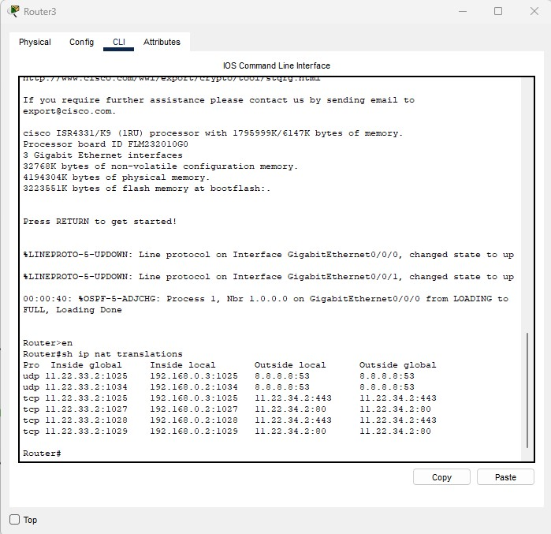

## Домашняя работа №7

* Настроить сеть согласно информации на схеме.

* Сымитировать "Интернет" с помощью OSPF. Приватных сетей в маршрутизации быть не должно.
*  Для компьютеров из Office 1 предоставить доступ в "Интернет" с помощью PAT.
* Открыть доступ из "Интернета" к серверам из Office 2 c помощью Port Forwarding.
* Для компьютеров из Office 1 должны открываться разные сайты по HTTP и HTTPS из Office 2 по одному доменному имени.
* Предоставить скриншот таблицы NAT трансляций с Router3.
* Предоставить скриншот таблицы маршрутизации с Router0.
------
Предоставить скриншоты открытых разных сайтов по одному доменному имени.
### Решение:

* Для компьютеров из Office 1 должны открываться разные сайты по HTTP и HTTPS из Office 2 по одному доменному имени.

----

* Предоставить скриншот таблицы NAT трансляций с Router3.

* Предоставить скриншот таблицы маршрутизации с Router0.

